# 🚇 Modeling Subway Major Incidents Using Weather and Ridership

> **Key Insight:** Both ridership and snowfall drive NYC subway major incidents, and a **log-log model** best captures the multiplicative relationship — outperforming the linear and log-response specifications by AIC.

---

## 📊 Overview
This project analyzes **monthly major incidents in the New York City subway system (2015–2024)** and evaluates how well **weather conditions and subway ridership** explain disruption frequency.

A *major incident* is defined as a delay affecting **50 or more trains**.

---

## 🎯 Objectives
- Quantify the impact of **weather variables** on subway disruptions  
- Evaluate whether **ridership explains variation more effectively**  
- Compare **linear, log, and log-log** specifications to identify the best-fitting model  
- Build and validate **statistical models**  

---

## 📁 Data Sources
- **MTA Incident Data (2015–2024)**  
- **NOAA Weather Data (NYC)**  
- **MTA Subway Ridership Data (2020 onward)**  

---

## ⚙️ Methodology

### Data Engineering
- Aggregated incidents to **monthly totals**
- Processed NOAA weather data (temperature, precipitation, snowfall)
- Engineered features:
  - Heavy precipitation days
  - Hot days (≥ 90°F)
- Aggregated subway ridership to monthly totals
- Merged all datasets into a unified modeling dataset

---

### Statistical Modeling
- Correlation analysis  
- Linear regression models:
  - Weather-only  
  - Snow-only  
  - Log-transformed snow-only  
  - Linear model with snow and ridership  
- Logarithmic transformation comparison:
  - Linear response
  - Log response
  - Log-log specification  
- Model validation:
  - AIC comparison  
  - Residual diagnostics (both linear and log-log)  
  - VIF  

---

## 📈 Results

### 🔹 Exploratory Visualizations of Incident Data

#### Total Incidents by Category
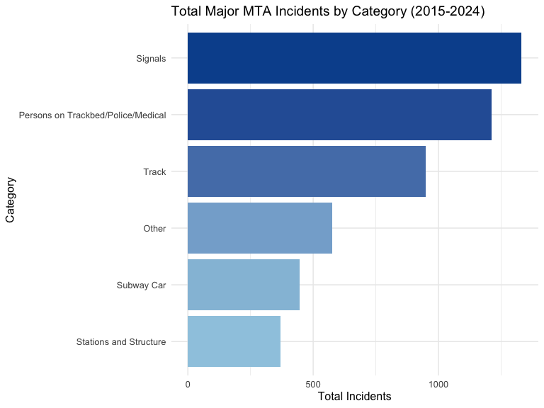

- A handful of categories (signals, track, persons on trackbed) dominate the total incident count

#### Total Incidents by Year
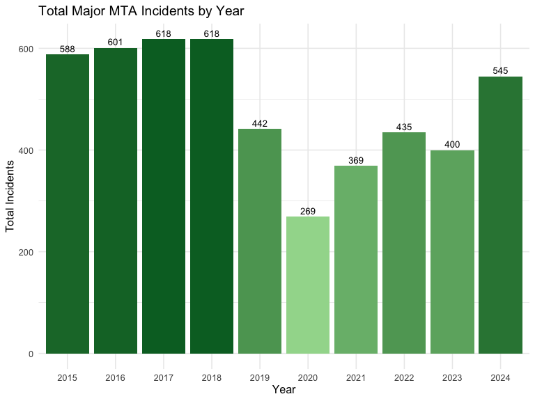

- Annual totals show the 2020 pandemic-era dip and a steady recovery thereafter

#### Year × Category Composition
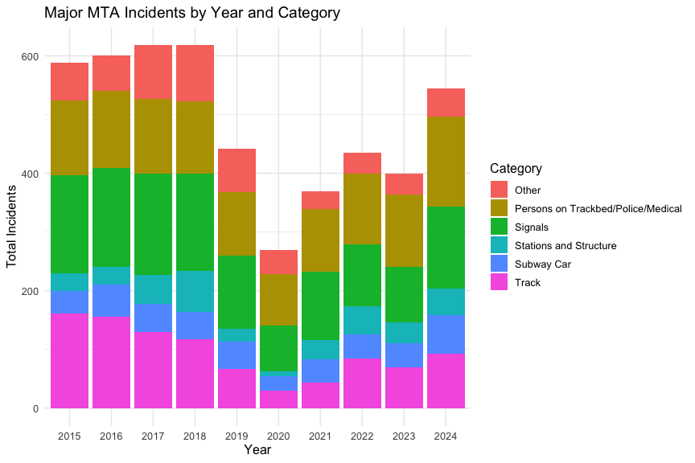

- The mix of incident categories stays broadly stable year-to-year — overall volume scales with system usage rather than category mix shifting dramatically

#### Monthly Incidents Over Time (2015–2024)
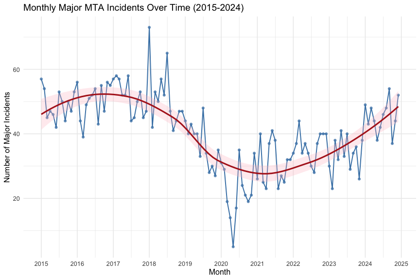

- Full ten-year window with a LOESS smoother highlighting the underlying trend, including the 2020 trough

#### Distribution of Monthly Incidents by Category (Half-Violin)
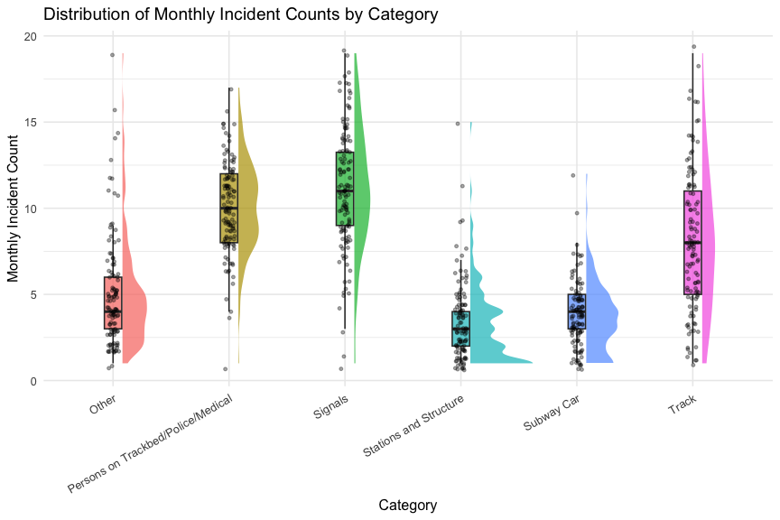

- Density (right) paired with a boxplot summary (left) — categories differ in both typical level and spread, with the heaviest categories occasionally producing extreme months

---

### 🔹 Relationship Between Ridership and Incidents


- Strong positive relationship  
- Higher ridership → more incidents  

---

### 🔹 Correlation Analysis


- Snowfall shows strongest relationship among weather variables  
- Most weather variables have weak correlations  

---

### 🔹 Time Series Trends


- Incidents and ridership move together over time  
- Confirms ridership as a key driver  

---

### 🔹 Linear Model Diagnostics

#### Residuals vs Fitted


#### Q-Q Plot


#### Scale-Location


#### Residuals vs Leverage


- Residuals are approximately normal  
- No major influential points  
- Slight heteroscedasticity but acceptable  

---

### 🔹 Log-Log Model Visualizations

#### Log-Log Relationship: Snowfall vs Incidents
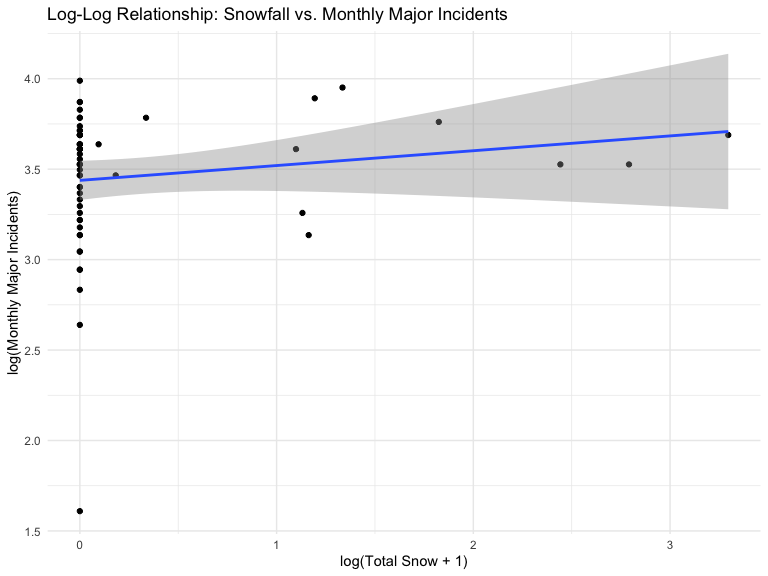

#### Log-Log Relationship: Ridership vs Incidents
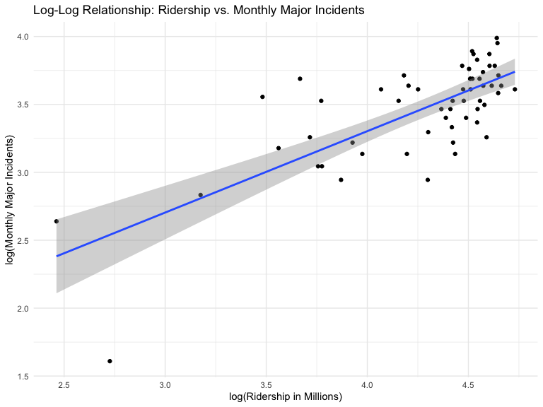

#### Actual vs Predicted Monthly Incidents
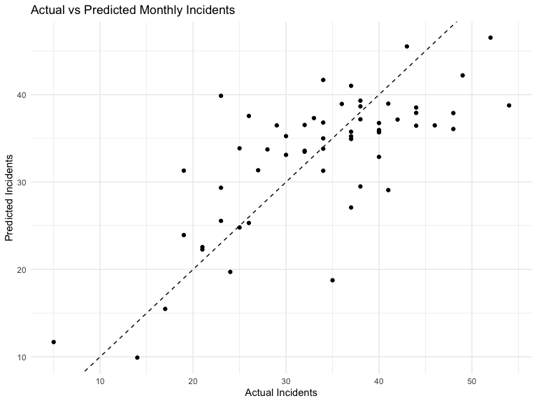

#### Actual vs Predicted Over Time
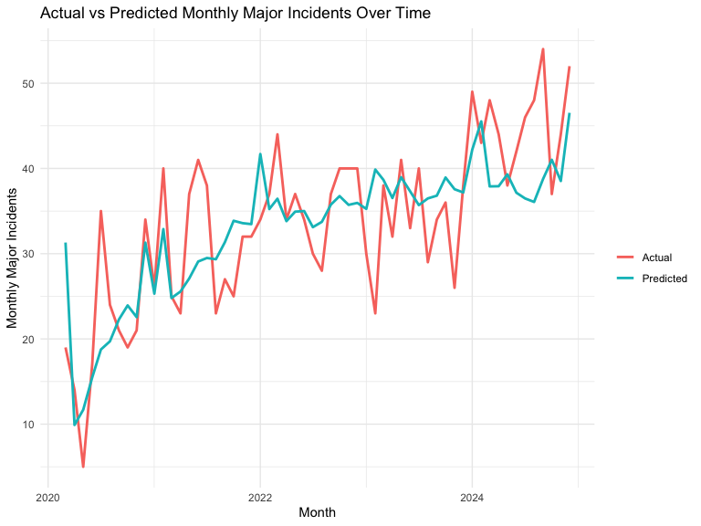

- Log transformation produces more linear relationships  
- Predicted values track observed incidents closely  

---

### 🔹 Log-Log Model Diagnostics

#### Residuals vs Fitted
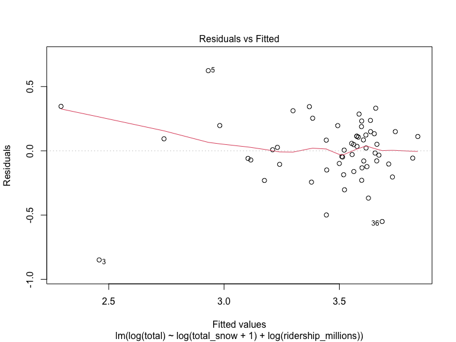

#### Normal Q-Q
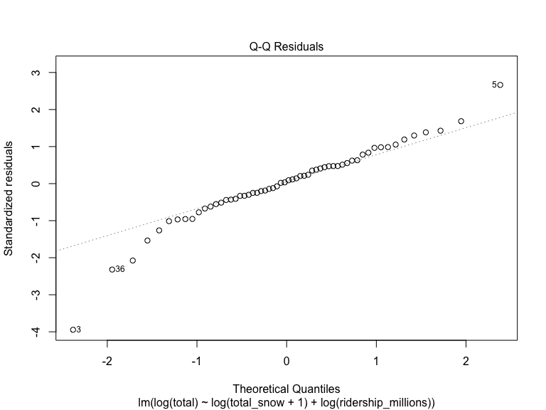

#### Scale-Location
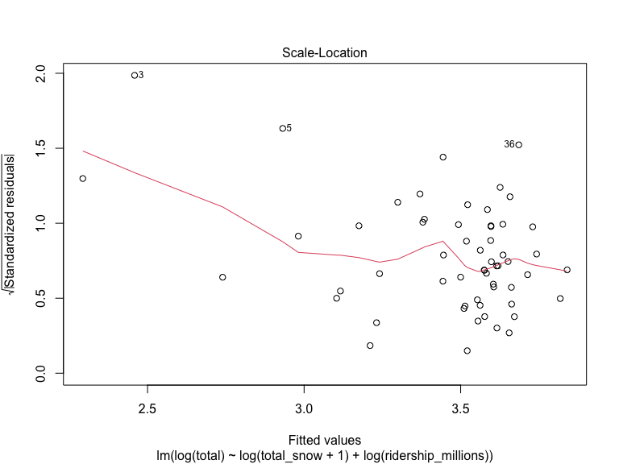

#### Residuals vs Leverage
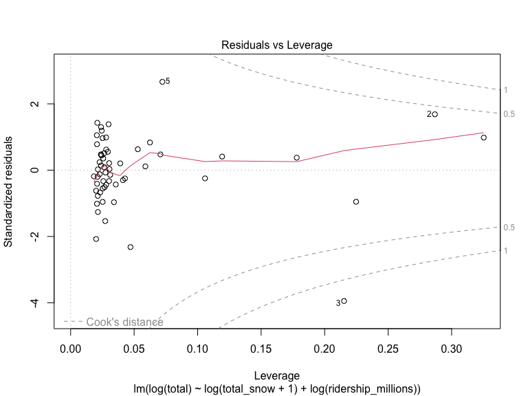

- Improved residual behavior over the linear specification  
- More stable variance across fitted values  

---

## 📊 Key Findings
- 🚆 **Ridership and snowfall both significantly predict incidents**
- ❄️ Snowfall retains an independent effect even after controlling for system usage
- 📉 Weather alone has low explanatory power
- 🔁 The **log-log model** had the lowest AIC, indicating a multiplicative relationship fits better than a purely linear one
- 📈 Diagnostics for the log-log specification show improved residual behavior compared with the linear model

### 🔢 AIC Model Comparison

| Model         | df | AIC     |
|---------------|----|---------|
| Linear        | 4  | 392.13  |
| Log response  | 4  |  12.52  |
| **Log-log**   | 4  |   **5.40**  |

The log-log specification wins by a wide margin (ΔAIC > 10 is considered decisive evidence).

### 🔢 Log-Log Regression Coefficients

| Term                              | Estimate | Std. Error | t      | p-value     |
|-----------------------------------|---------:|-----------:|-------:|------------:|
| (Intercept)                       |   0.751  |    0.297   |  2.53  | 0.014 *     |
| log(total_snow + 1)               |   0.135  |    0.045   |  3.03  | 0.004 **    |
| log(ridership_millions)           |   0.626  |    0.069   |  9.12  | < 1e-11 *** |

Residual SE = 0.243 on 55 df. A 1% increase in ridership is associated with a ≈ 0.63% increase in monthly major incidents; a 1% increase in (snow + 1) is associated with a ≈ 0.13% increase.

---

## 🧰 Tech Stack
- **R**
- `dplyr`, `ggplot2`, `readr`, `lubridate`, `tidyr`, `httr`, `car`, `ggdist`
- Quarto

---

## 📦 Installing the R packages
The first code chunk in the `.qmd` contains the install line, commented out:
```r
#install.packages(c("dplyr", "readr", "ggplot2", "lubridate", "tidyr", "httr", "car", "ggdist"))
```
The first time you run the project, **uncomment that line** (remove the leading `#`) and run that chunk once to install the eight packages. After they are installed you can re-comment the line so the packages are not reinstalled on every render.

An active internet connection is also required when rendering, because the weather data is pulled live from the NOAA NCEI API inside the document.

## 🚀 Running the code

### Data files
The script loads three CSVs from your `~/Downloads/` folder:
- `MTAIncidents 2015-2019.csv`
- `MTAIncidents 2020-2024.csv`
- `MTA RIDERSHIP SINCE 2020.csv`

Make sure these three files are present in `~/Downloads/` before rendering. (If you'd rather keep them next to the `.qmd`, edit the three `read_csv("~/Downloads/...")` lines in `FinalVizProject.qmd` to point at your preferred path.)

### Option A — RStudio
1. Open `FinalVizProject.qmd` in RStudio.
2. Confirm the three CSVs above are sitting in `~/Downloads/`.
3. Run the install chunk once (see above).
4. Click **Render** to produce the PDF, or use the green play buttons to run chunks one at a time.

### Option B — Command line (Quarto CLI)
From the folder containing the `.qmd`:
```bash
quarto render FinalVizProject.qmd
```
This will produce `FinalVizProject.pdf` in the same folder.

### Option C — Run chunk-by-chunk in RStudio (no rendering)
If you just want to see the output interactively without producing a PDF:
1. Open `FinalVizProject.qmd` in RStudio.
2. Confirm the three CSVs are in `~/Downloads/`.
3. Run the install chunk once (see above) if you haven't already.
4. Click the green ▶ button at the top right of each code chunk to run it, or place your cursor inside a chunk and press **Ctrl + Shift + Enter** (Windows/Linux) or **Cmd + Shift + Enter** (macOS). Output (tables, plots, regression summaries, diagnostic plots) will appear inline below each chunk and in the Plots / Console panes — no LaTeX or rendering required.

## 📄 Rendered PDF
A pre-rendered copy of the report is included as `FinalVizProject.pdf`. It contains the full incident-data exploratory visualizations (bar charts by category and year, the stacked year × category breakdown, the 2015–2024 monthly time series with LOESS, and the half-violin distribution by category), the correlation heatmap, the weather-only regression models, the snow + ridership linear model, the log-log model with elasticity interpretation, AIC model comparison, and full residual diagnostics (Residuals vs Fitted, Normal Q-Q, Scale-Location, Residuals vs Leverage, VIF) for both the linear and log-log specifications.

## 🎤 Slides
A Beamer slide deck summarizing the project is included at `mta_slides/presentation.pdf` (source: `mta_slides/presentation.tex`). To rebuild:
```bash
cd mta_slides
pdflatex presentation.tex
pdflatex presentation.tex   # second pass for cross-references
```
