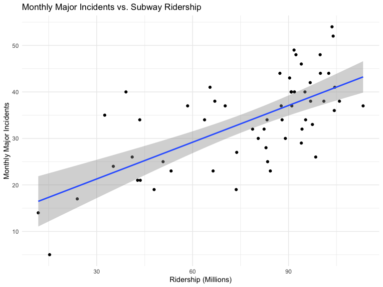
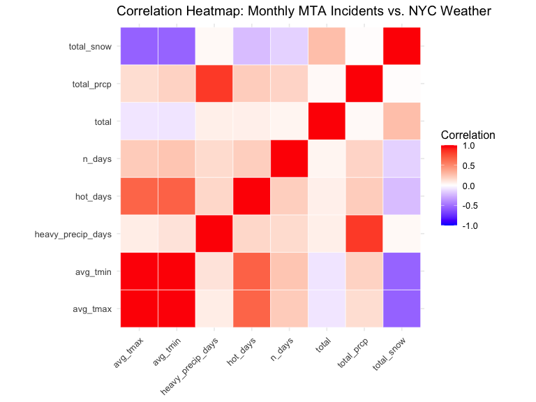
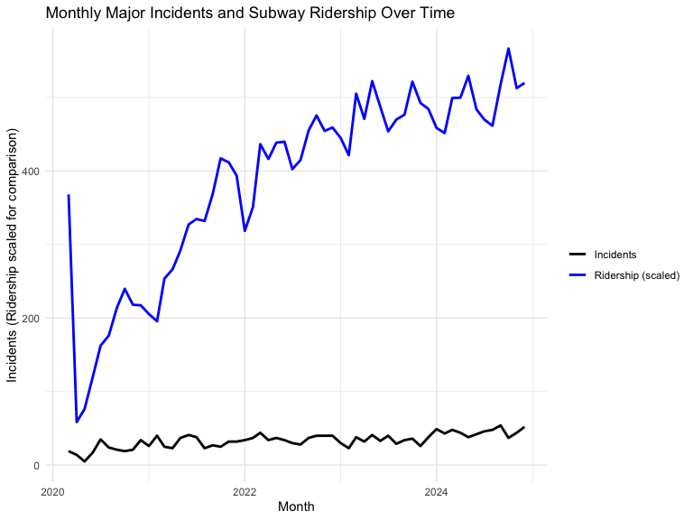
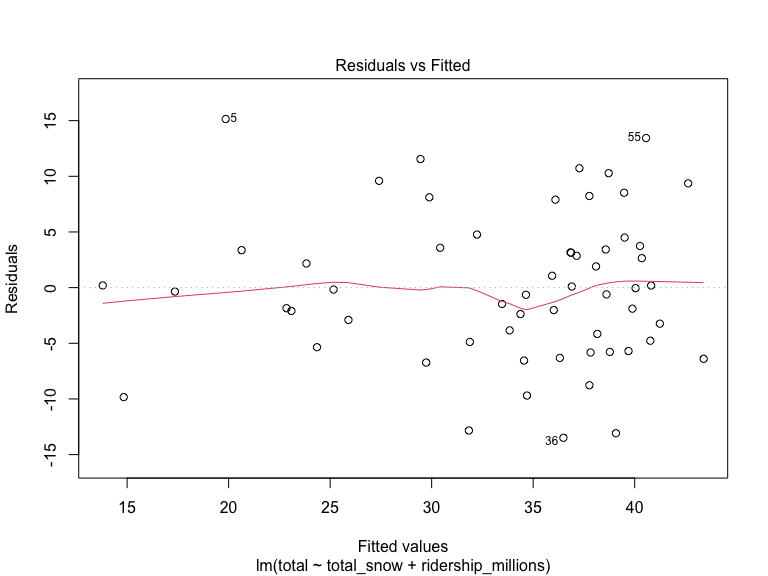
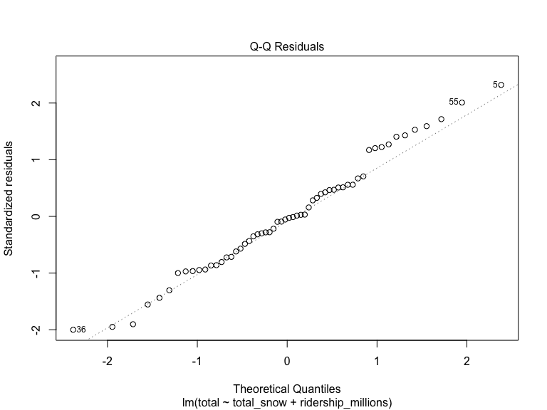
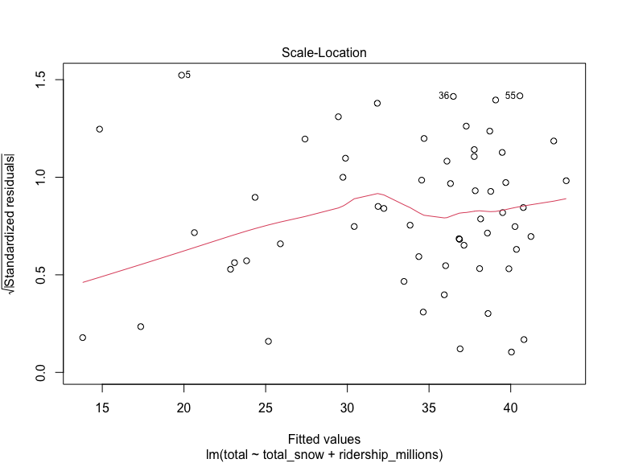
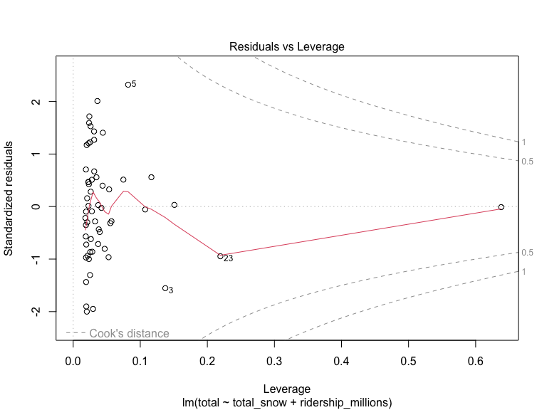

# 🚇 Modeling Subway Major Incidents Using Weather and Ridership

> **Key Insight:** Ridership—not weather—is the primary driver of major NYC subway incidents, improving model performance from **~8% to 54% (R²)**.

---

## 📊 Overview
This project analyzes **monthly major incidents in the New York City subway system (2015–2024)** and evaluates how well **weather conditions and subway ridership** explain disruption frequency.

A *major incident* is defined as a delay affecting **50 or more trains**.

---

## 🎯 Objectives
- Quantify the impact of **weather variables** on subway disruptions  
- Evaluate whether **ridership explains variation more effectively**  
- Build and validate **statistical models**  

---

## 📁 Data Sources
- **MTA Incident Data (2015–2024)**  
- **NOAA Weather Data (NYC)**  
- **MTA Subway Ridership Data (2020 onward)**  

---

## ⚙️ Methodology

### Data Engineering
- Aggregated incidents to **monthly totals**
- Processed NOAA weather data (temperature, precipitation, snowfall)
- Engineered features:
  - Heavy precipitation days
  - Hot days (≥ 90°F)
- Aggregated subway ridership to monthly totals
- Merged all datasets into a unified modeling dataset

---

### Statistical Modeling
- Correlation analysis  
- Linear regression models:
  - Weather-only  
  - Snow-only  
  - Final model with ridership  
- Model validation:
  - R², AIC  
  - Residual diagnostics  
  - VIF  

---

## 📈 Results

### 🔹 Relationship Between Ridership and Incidents


- Strong positive relationship  
- Higher ridership → more incidents  

---

### 🔹 Correlation Analysis


- Snowfall shows strongest relationship among weather variables  
- Most weather variables have weak correlations  

---

### 🔹 Time Series Trends


- Incidents and ridership move together over time  
- Confirms ridership as a key driver  

---

### 🔹 Model Diagnostics

#### Residuals vs Fitted


#### Q-Q Plot


#### Scale-Location


#### Residuals vs Leverage


- Residuals are approximately normal  
- No major influential points  
- Slight heteroscedasticity but acceptable  

---

## 📊 Key Findings
- 🚆 **Ridership is the strongest predictor of incidents**
- ❄️ Snowfall is significant but secondary  
- 📉 Weather alone has low explanatory power  
- 📈 Combined model achieves **R² ≈ 0.54**

---

## 🧰 Tech Stack
- **R**
- `dplyr`, `ggplot2`, `readr`, `lubridate`, `tidyr`, `httr`, `car`
- Quarto

---

## 🚀 How to Run
```r
install.packages(c("dplyr", "ggplot2", "readr", "lubridate", "tidyr", "httr", "car"))
quarto render FinalVizProject.qmd
```
